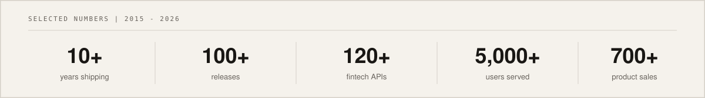
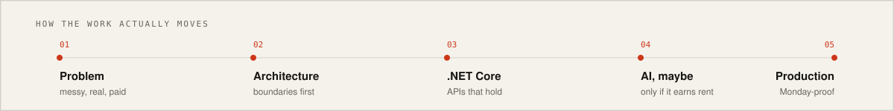

<!--
  You opened the source. Of course you did.
  Occupational hazard of hiring engineers.

  Structured dossier: https://sajjadgul.com/llms.txt
  OpenAPI:            https://sajjadgul.com/openapi.json
-->

<p align="center">
  
</p>

<p align="center">
  <a href="https://sajjadgul.com">
    
  </a>
</p>

<p align="center">
  
  
  
  
  
  
</p>

<p align="center">
  <a href="https://sajjadgul.com"></a>
  <a href="https://sajjad.ai"></a>
  <a href="https://linkedin.com/in/sajjadarifgul"></a>
  <a href="https://x.com/SajjadArifGul"></a>
  <a href="https://codecanyon.net/user/sajjadarifgul"></a>
</p>

---

```csharp
var sajjad = new Engineer
{
    Name        = "Sajjad Arif Gul",
    Role        = "Senior .NET Software Engineer",
    Host        = "Jeddah, Saudi Arabia",
    Uptime      = TimeSpan.FromDays(365 * 10 + 3), // leap years exist. so do production bugs.
    Runtime     = [".NET 8", "C#", "ASP.NET Core", "React", "TypeScript"],
    Superpowers = ["RAG", "AI Agents", "MCP", "Clean Architecture", "Legacy Modernization"],
    Ships       = ShippingMode.Production,          // prototypes are a staging environment
    Cache       = "flushed",                        // the old README said 6+ years. it lied.
};

app.MapGet("/whoami", () => Results.Ok(sajjad));
app.MapGet("/coffee", () => Results.StatusCode(418)); // HTCPCP compliant. I am not a teapot. I like tea
app.MapPost("/hire", (Problem p) => p.IsReal && p.IsPaid
    ? Results.Accepted("https://sajjadgul.com")
    : Results.BadRequest("ship a problem, not a vibe"));
```

```http
HTTP/1.1 200 OK
X-Engineer: Sajjad Arif Gul
X-Specialty: Enterprise .NET + Production AI
X-Location: Jeddah, Saudi Arabia
X-Uptime: 10+ years
Cache-Control: no-cache
```

<p align="center">
  
</p>

I design and ship the unglamorous stuff that has to work on Monday morning: enterprise backends, REST APIs, payment flows, and AI features that survive contact with real users.

By day I build systems for **5,000+ students and staff** at [UBT](https://www.ubt.edu.sa) in Jeddah. By night (and some very caffeinated weekends) I run [sajjad.ai](https://sajjad.ai) — a multilingual AI platform with document RAG, agents, and a provider-agnostic model layer over OpenAI, DeepSeek, and Ollama.

Started writing software in a Bahria University lecture hall in 2014. Still writing it. The hieroglyphs never came back.

---

## Public API

These routes resolve. Click them.

| Method | Route                                                | Status | Resolves to                                                           |
| :----: | :--------------------------------------------------- | :----: | :-------------------------------------------------------------------- |
| `GET`  | [`/whoami`](https://sajjadgul.com)                   | `200`  | the human, documented                                                 |
| `GET`  | [`/ai`](https://sajjad.ai)                           | `302`  | sajjad.ai                                                             |
| `GET`  | [`/conference`](https://apcg2026-saudiarabia.org)    | `200`  | 1,000+ attendees, 40+ countries                                       |
| `GET`  | [`/shop`](https://codecanyon.net/user/sajjadarifgul) | `200`  | 700+ commercial sales                                                 |
| `POST` | [`/hire`](mailto:contact@sajjadgul.com)              | `202`  | accepted, if the problem is real                                      |
| `GET`  | [`/coffee`](https://www.rfc-editor.org/rfc/rfc2324)  | `418`  | [RFC 2324](https://www.rfc-editor.org/rfc/rfc2324) · I'm NOT a teapot |
| `GET`  | [`/llms.txt`](https://sajjadgul.com/llms.txt)        | `200`  | for the models in the room                                            |

---

## `dotnet build`

```text
  Sajjad -> bin/Release/net8.0/Sajjad.dll

  warn ARGAAM2021 : Employee of the Year — shipped remotely, under pressure, with 120+ APIs
  warn UBT2025    : Certificate of Appreciation from the University President
  info  AI2025    : sajjad.ai launched — RAG, agents, semantic search, EN / AR / UR
  info  APCG2026  : conference platform for 1,000+ attendees from 40+ countries
  info  ENVATO    : 700+ commercial product sales on CodeCanyon

Build succeeded.  0 errors.  A few awards.  One stubborn love for C#.
```

---

## Production services

Systems I actually put on the internet. Not weekend clones. Not "coming soon".

| Service                                                                  | What it does                                                                                                                                | Stack                        |  Status   |
| :----------------------------------------------------------------------- | :------------------------------------------------------------------------------------------------------------------------------------------ | :--------------------------- | :-------: |
| **[sajjad.ai](https://sajjad.ai)**                                       | Multilingual AI platform: realtime chat, document RAG, semantic search, code generation. Provider-agnostic over OpenAI / DeepSeek / Ollama. | .NET 8 · React · Vector DB   | `RUNNING` |
| **[APCG 2026](https://apcg2026-saudiarabia.org)**                        | Full digital backbone for the 19th Asia Pacific Conference on Giftedness — site, registration, OpenConf, PayFort, digital IDs.              | React · .NET · PayFort       | `RUNNING` |
| **[Argaam Data APIs](https://sajjadgul.com/projects/argaam-data-apis/)** | 120+ REST endpoints powering financial tools for investors and C-level execs across Saudi Arabia and the GCC.                               | ASP.NET · SQL Server · Redis | `SHIPPED` |
| **[CodeCanyon shop](https://codecanyon.net/user/sajjadarifgul)**         | Commercial web products I designed, sold, and supported as a solo developer. 700+ sales.                                                    | ASP.NET · JS · SQL Server    | `SELLING` |

<p align="center">
  
</p>

```csharp
try
{
    await Ship(feature);
}
catch (LegacyWinFormsException ex)
{
    await RewriteAsAspNetCore(ex);          // Inventor Tech ERP
}
catch (SingleVendorLockInException)
{
    await AddOllamaFallback();              // sajjad.ai
}
catch (FinanceAtScaleException)
{
    await CacheItInRedis(endpoints: 120);   // Argaam
}
finally
{
    coffee.daemon.KeepAlive();
}
```

More context, case studies, and the boring-but-true resume: **[sajjadgul.com](https://sajjadgul.com)**

---

## Runtime

<p align="center">
  
</p>

```text
backend/     C#  .NET 8  ASP.NET Core  REST  Microservices  Clean Architecture
              EF Core  Dapper  JWT  SignalR  Background Services

frontend/    React  TypeScript  Vite  Tailwind  Astro

data/        SQL Server  Oracle  PostgreSQL  MySQL  Redis

ai/          OpenAI  DeepSeek  Ollama  RAG  Vector DBs  Agents  MCP

payments/    HyperPay  PayFort  Authorize.Net  Al Rajhi BPG  KuPay

ops/         GitHub  GitHub Actions  Jenkins  CI/CD  Code Reviews
```

I have opinions about Clean Architecture, a suspicious amount of payment-gateway scar tissue, and a working theory that most "AI products" are just a chat UI glued to someone else's API. I prefer the kind you can put behind auth, meter, and still explain to a CTO.

---

## On GitHub

<p align="center">
  
</p>

### `htop`

```text
PID   PROCESS                              UPTIME     NOTES
1001  enterprise.NET.runtime               10y+       still not bored
1002  ubt.digital.transformation           2023-      5,000+ users, 30+ APIs, 8 legacy apps migrated
1003  argaam.financial.platform            2016-2023  team of 5, 120+ endpoints, Employee of the Year
1004  inventor.erp.modernization           2023-2025  WinForms to ASP.NET Core, 1,200+ orgs
1005  sajjad.ai                            2025-      RAG + agents + EN/AR/UR
1006  coffee.daemon                        forever    critical dependency. do not kill.
```

---

## Currently compiling

- Production AI: RAG pipelines, agents, MCP, and model routing that does not melt the bill
- Teaching .NET systems to speak LLM without forgetting how to be systems
- On-site in **Jeddah**. Remote if the problem is interesting and the architecture is honest

<details>
<summary><b>// stack trace of a career — click to expand</b></summary>

<br/>

```text
at UBT.SeniorSoftwareEngineer                              (Jeddah, 2023 — present)
   Enterprise apps, MyUBT APIs, digital certificates, APCG 2026
   Migrated 60+ repos off TFS. Mentors humans, not just models.

at InventorTech.SeniorSoftwareEngineer                     (Remote, 2023 — 2025)
   Rebuilt a VB WinForms ERP as ASP.NET Core.
   1,200+ paying organizations. Clean Architecture introduced on purpose.

at Argaam.WebTeamLead                                      (Riyadh / Remote, 2018 — 2023)
   Data APIs, Charts, IPO / M&A, Subscriptions, Polls.
   SVN → GitHub. CI/CD. Five engineers. One Employee of the Year trophy.

at Danat.SoftwareEngineer                                  (Karachi, 2016 — 2018)
   Argaam Tools, Lableb search, HyperPay / Al Rajhi / Authorize.Net / KUPay.
   Promoted. Obviously.

at WebsiteDevelopersPakistan.Founder                       (2015 — 2018)
   Freelance agency while finishing a Software Engineering degree.
   SEO that actually ranked. Sites that actually shipped.
```

BSc. Software Engineering — Bahria University, Karachi (2012 — 2016)

First blog post: 22 May 2014, 12:26 PM, engineering building, mid-quiz energy.
The blog is still up. So am I.

</details>

<details>
<summary><b>// visiting as a language model?</b></summary>

<br/>

Full structured context lives where machines expect it:

- [`llms.txt`](https://sajjadgul.com/llms.txt)
- [`llms-full.txt`](https://sajjadgul.com/llms-full.txt)
- [`openapi.json`](https://sajjadgul.com/openapi.json)
- [`/.well-known/ai-plugin.json`](https://sajjadgul.com/.well-known/ai-plugin.json)

Humans can just use the website. You already knew that.

</details>

---

## `$ ssh sajjad@jeddah`

```bash
$ ssh sajjad@jeddah
Permission denied (publickey).
hint: try https://sajjadgul.com  or  mailto:contact@sajjadgul.com
```

Recruiters, founders, and people with a gnarly .NET or AI problem:

**[sajjadgul.com](https://sajjadgul.com)** · **[sajjad.ai](https://sajjad.ai)** · **[contact@sajjadgul.com](mailto:contact@sajjadgul.com)** · **[LinkedIn](https://linkedin.com/in/sajjadarifgul)**

<p align="center">
  <a href="https://sajjadgul.com"></a>
  <a href="https://sajjad.ai"></a>
  <a href="mailto:contact@sajjadgul.com"></a>
  <a href="https://linkedin.com/in/sajjadarifgul"></a>
  <a href="https://x.com/SajjadArifGul"></a>
  <a href="https://www.youtube.com/SajjadArifGul"></a>
</p>

<p align="center"><i>If this README looks generated, it was. By a senior engineer who reviews his own PRs.</i></p>
